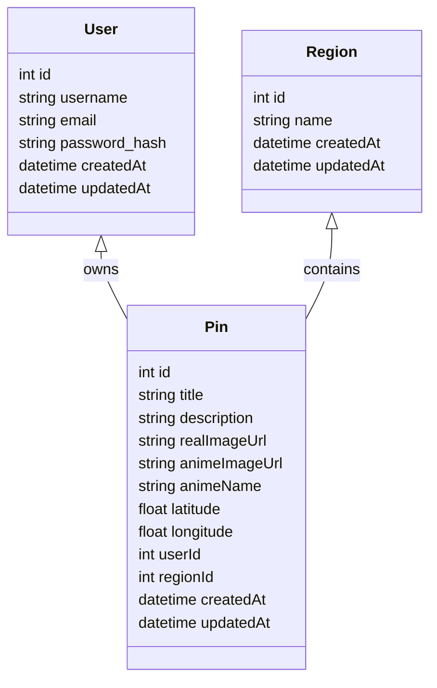

# AniMap

AniMap on anime asukohateabe tahvli rakendus. See võimaldab kasutajatel registreeruda, autentida ja luua geosildiga märgistatud tahvleid, mis ühendavad reaalseid asukohti anime viidete ja piltidega.
<br><br>
Live demo: https://sandertamm.eu

## Projekti eesmärk

Eesmärk on pakkuda animehuvilistele veebipõhist rakendust, kus saab salvestada ja jagada anime-teemalisi asukohapunkte ning vaadata populaarsemaid animeid ja piirkondi.

## Pildid

### Kaart


### Kasutajakonto


### Statistika


## Kasutatud tehnoloogiad

- Backend: Node.js, Express - kerge ja mitte liiga ette kirjutav raamistik, mis lubas meil MVC kihid ise üles ehitada, selle asemel et võidelda raskema raamistiku konventsioonidega.
- Andmebaas: AWS RDS MySQL (development/prod), SQLite testimiseks - RDS valisime selleks, et harjutada päris tootmiskeskkonna sarnase, hallatava andmebaasiga töötamist (varukoopiad, ühenduste piirangud, võrguseaded), mitte lokaalse Dockeri andmebaasiga, mis need probleemid varjab; SQLite testides kiiruse ja väliste sõltuvusteta CI jaoks.
- ORM: Sequelize - andis meile migratsioonid ja mudelitasandi valideerimise, selle asemel et kirjutada iga päringu jaoks käsitsi SQL-i.
- Autentimine: JWT + küpsised - JWT, et backend jääks olekuta (state'ita, ei pea haldama sessioonipoodi); token on salvestatud httpOnly küpsisesse, mitte localStorage'isse, et vähendada XSS-i kaudu tokeni kättesaamise riski.
- Failihaldus: `multer`, Base64-pildi salvestus serverisse - valisime S3 EC2/EB instantsi kohaliku salvestuse asemel, et üleslaaditud pildid säiliksid ka pärast taaskäivitamist või uut deploy'd. Kui ma selle uuesti ehitaksin, viiksin piltide üleslaadimise üle eelallkirjastatud S3 URL-i lahendusele, selle asemel et suunata need läbi taustasüsteemi.
- Dokumentatsioon: Swagger / OpenAPI
- Testimine: Jest, Supertest
- Keskkonna muutujad: dotenv
- Frontend: Vite, React - Vite kiirema arenduskeskkonna ja HMR jaoks võrreldes CRA aeglasema build-protsessiga.
- Täiendavad paketid: `bcryptjs` (paroolide räsimine), `cookie-parser`, `cors` (frontend ja backend erinevatel domeenidel/hostidel, seega oli vajalik selgesõnaline CORS-i seadistus), `country-reverse-geocoding` + `countries-list` + `iso-3166-1` (pini koordinaatide teisendamiseks riigiks/piirkonnaks "populaarsete piirkondade" funktsiooni jaoks).
- Hostimine: Backend on AWS'il EC2 koos CloudFrontiga ees ja S3-ga piltide jaoks; andmebaas AWS RDS-is; frontend Zone.ee's — jagasime frontendi ja backendi hostimise, et jäljendada päris tootmiskeskkonna tavapärast eraldatust

## Arhitektuur: MVC projekti kontekstis

AniMap backend järgib MVC printsiipi:

- **Model**: `backend/models/` sisaldab Sequelize andmemudeleid (`User`, `Pin`, `Region`). Need kirjeldavad andmebaasi tabelite struktuuri ja assotsiatsioone.
- **View**: API vastused JSON-formaadis ning frontend rakenduse komponendid (`frontend/src/...`) kuvavad need andmed kasutajale.
- **Controller**: `backend/controllers/` tegelevad sissetulevate päringute loogikaga, valideerivad andmed ja loovad vastuseid.

`backend/routes/` kaardistab URL-id controller-funktsioonidele, seega vastab see vahel autotee (route) ja kontrollija vahelisele kihistusele.

## ORM-i kasutus ja andmemudel

Sequelize ORM haldab andmebaasi struktuuri ja päringuid JavaScripti tasandil. Mudelid on defineeritud `backend/models/` kaustas.

Peamised mudelid:

- `User`:
  - `id`, `username`, `email`, `password_hash`, `createdAt`, `updatedAt`
- `Pin`:
  - `id`, `title`, `description`, `realImageUrl`, `animeImageUrl`, `animeName`, `latitude`, `longitude`, `userId`, `regionId`, `createdAt`, `updatedAt`
- `Region`:
  - `id`, `name`, `createdAt`, `updatedAt`

### Andmemudeli diagramm



## Käivitusjuhend

### Eeldused

- Node.js
- npm
- MySQL või Docker Compose
- Frontend: Vite

### Backend käivitamine

```bash
cd backend
npm install
cp .env.example .env
npm run test
node server.js
```

Kui kasutate Docker Compose'i, siis root-kataloogist:

```bash
sudo docker compose up -d
```

### Frontend käivitamine

```bash
cd frontend
npm install
npm run dev
```

### Andmebaasi migratsioonid ja seederid

```bash
cd backend
npx sequelize-cli db:migrate
npx sequelize-cli db:seed
```

## .env.example selgitus

Backendis asub `.env.example` fail `backend/.env.example`. See näitab vajalikke keskkonnamuutujaid:

- `DB_USER`: andmebaasi kasutajanimi
- `DB_PASS`: andmebaasi parool
- `DB_NAME`: andmebaasi nimi
- `JWT_SECRET`: JSON Web Tokeni saladus

Frontendis on `frontend/.env.example`, mis näitab vajalikku Mapboxi tokeni kujul `VITE_MAPBOX_TOKEN`.

## Swagger / API dokumentatsioon

Swagger UI on saadaval pärast backendi käivitamist aadressil:

- http://animapbackend.eu-north-1.elasticbeanstalk.com/api-docs/

See dokumentatsioon kirjeldab peamised endpointid, HTTP meetodid, päringu keha näited, vastuste näited ja veakoodid.

## Google Docs dokumentatsioon

Täiendavat projekti dokumentatsiooni hoitakse Google Docs dokumendis.

- https://docs.google.com/document/d/1tlvhqbwdrXiD0RCi1Ctuv6W4-xHynb0HzWWgmhb81xg/edit?usp=sharing

## Testide käivitamise juhend

Backend testimiseks:

```bash
cd backend
npm run test
```

### Unit testid

Unit-testid kontrollivad erapooletult backendkontrollerite ja äriloogika õigsust. Need kasutavad Jest-i ja asendavad välised sõltuvused päris implementatsioonidega mockidega, mistõttu nad ei sõltu andmebaasist, võrgust ega autentimiskomponentidest.

Näited ja põhimõtted:

- `backend/tests/auth/auth.unit.test.js`
  - kontrollib `auth.controller` register-, login- ja logout-loogikat
  - testib paroolide kokkulangevust, duplikaatkasutaja tuvastamist ja JWT tokeni loomist
  - mockib `User` Sequelize mudelit, `bcryptjs`-i ja `jsonwebtoken`-i
- `backend/tests/pin/pin.unit.test.js`
  - kontrollib `pin.controller` pin`i loomise, päringute ja uuenduste äriloogikat
  - testib eelduste valideerimist, pildi salvestamise ja geograafilise regiooni määramist
  - mockib `Pin`, `Region`, failisüsteemi ja kolmandate osapoolte abiteenuseid

### Integratsioonitestid

Integratsioonitestid käivitavad tegeliku Expressi rakenduse ning teevad selle vastu päringuid `supertest`-iga. Need testid kinnitavad, et kogu rakenduse virn töötab koos: route'id, keskkonnamuutujad, middleware'id, auth-kupsised ja andmebaasiread.

Näited ja kontrollpunktid:

- `backend/tests/auth/auth.integration.test.js`
  - testib kasutaja registreerimise, sisselogimise, autentimise ja väljalogimise voogu
  - kontrollib, et JWT token salvestatakse küpsisesse ja et autentitud endpointid (/api/auth/me, /api/auth/health) töötavad
  - testib, et väljalogimine eemaldab juurdepääsu ja tagab 401 vastuse ilma tokenita
- `backend/tests/pin/pin.integration.test.js`
  - testib pin`ide loomise ja pärimise terviklikku voogu
  - kontrollib, et pins luuakse andmebaasi, et tagasiside on õige ja et vigu käsitletakse sobivate staatusekoodidega

## Meeskonnaliikmed ja tööjaotus

- **Sander** - Implementeerisin JWT-autentimise ja küpsiste halduse, täiustasin integratsiooni ja unit teste, lõin Sequelize'i mudelid ja migratsioonid ning juurutasin taustasüsteemi AWS Elastic Beanstalki, kasutades RDS-i, S3-e ja CloudFronti.
- **Olha** - Implementeerisin pin controllerid, implementeerisin integratsiooni ja unit testid, React kasutajaliidese arendus, dokumentatsioon, README, Swagger.

## Lisainfo

- Backend API asub `backend/`
- Frontend rakendus asub `frontend/`
- Swagger dokumentatsioon on integreeritud backendi failis `backend/app.js`
- Andmebaasi mudelid asuvad `backend/models/`
